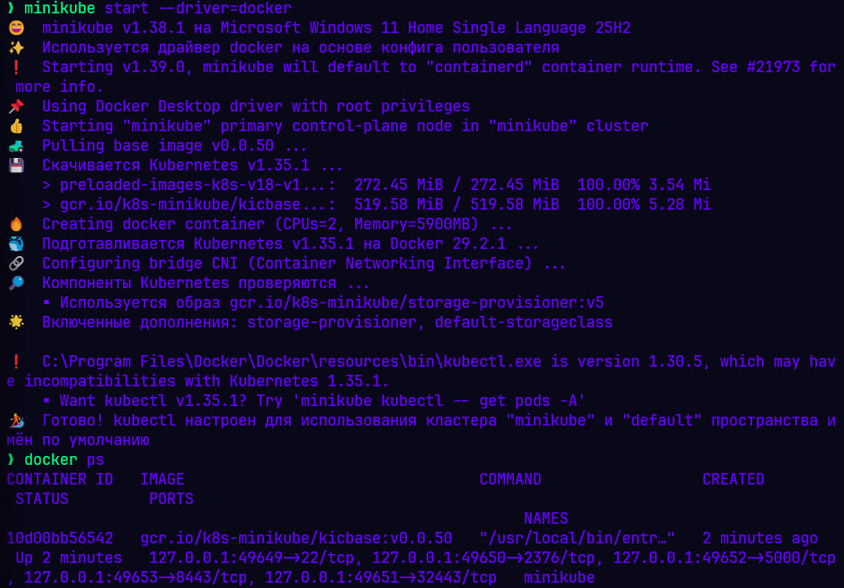
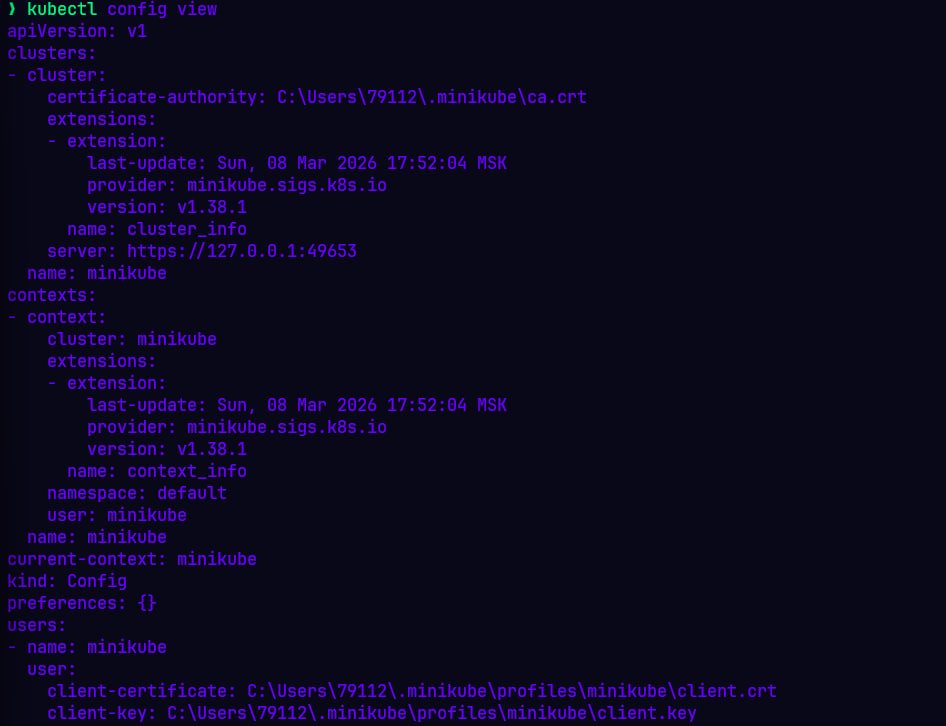
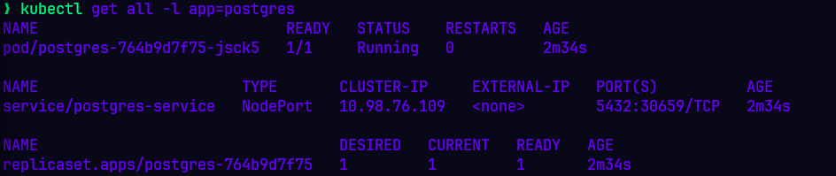
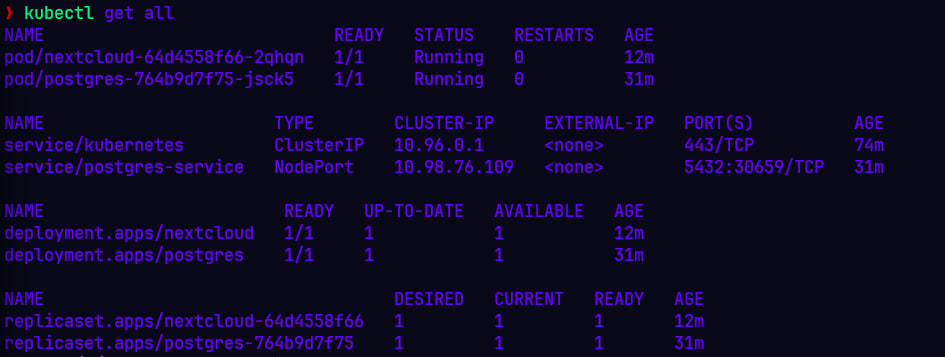
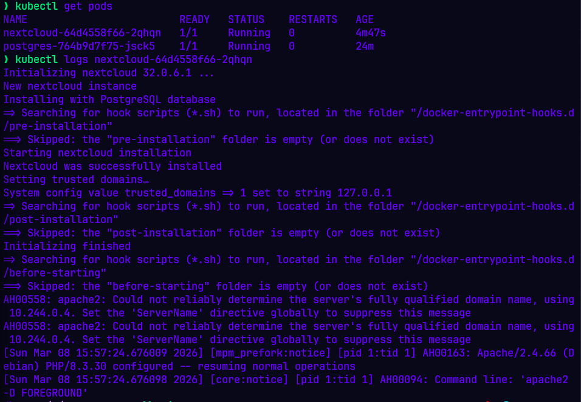
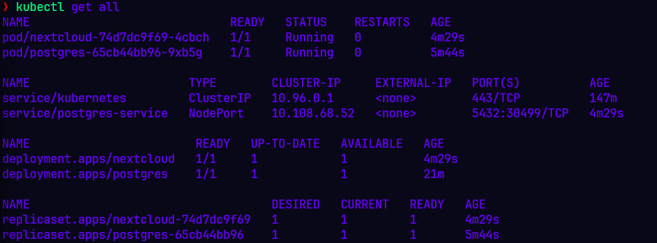
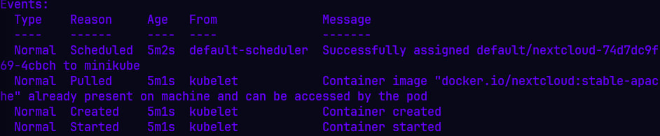

# Лабораторная работа №3: Развертывание приложения в Kubernetes

**Исполнитель:** Томин Денис

## 1. Описание задачи
Развертывание отказоустойчивого стека приложения Nextcloud и базы данных PostgreSQL в локальном кластере Minikube с использованием лучших практик Kubernetes (Secrets, ConfigMaps, Probes).

## 2. Ход работы
### Шаг 0: Полготовка и скачивание

Установка необходимых зависимостей и ключей для Kubernetes:
```bash
sudo apt-get update &&
sudo apt-get install -y apt-transport-https ca-certificates curl
```

Добавление репозитория Kubernetes:
```bash
curl -fsSL https://pkgs.k8s.io/core:/stable:/v1.31/deb/Release.key | sudo gpg --dearmor -o /etc/apt/keyrings/kubernetes-apt-keyring.gpg &&
echo 'deb [signed-by=/etc/apt/keyrings/kubernetes-apt-keyring.gpg] https://pkgs.k8s.io/core:/stable:/v1.31/deb/ /' | sudo tee /etc/apt/sources.list.d/kubernetes.list
```

Установка kubectl и скачивание Minikube:
```bash
sudo apt-get install -y kubectl &&
curl -LO https://github.com/kubernetes/minikube/releases/latest/download/minikube-installer.exe
```

Предоставляем права на исполнение и переходим в GUI для установки:
```bash
chmod +x minikube-installer.exe
./minikube-installer.exe
```

### Шаг 1: Запуск кластера
Кластер запущен командой `minikube start`.


Поскольку `minikube.exe` работает в Windows, он обновляет конфигурацию (`kubeconfig`) внутри хост-системы. При этом `kubectl`, установленный в WSL, ищет настройки в локальном пустом файле `~/.kube/config`. Для корректной работы в WSL были настроены символические ссылки и адаптированы пути:
```bash
rm -rf ~/.kube &&
mkdir -p ~/.kube &&
ln -s /mnt/c/Users/<USER>/.kube/config ~/.kube/config

sed -i 's|C:\\Users\\<USER>|/mnt/c/Users/<USER>|g' ~/.kube/config &&
sed -i 's|\\|/|g' ~/.kube/config
```

Статус успешно запущенного кластера:


### Шаг 2: Создание манифестов
Для работы приложения были подготовлены манифесты (Deployments, Services, ConfigMaps, Secrets). В качестве основы используются официальные Docker-образы:
- postgres:14 — для реляционной базы данных.
- nextcloud:stable-apache — для основного веб-приложения.

### Шаг 3: Применение конфигурации

Созданы манифесты для базы данных. Использован `ConfigMap` для хранения параметров подключения.

```bash
kubectl create -f pg_configmap.yaml
kubectl create -f pg_service.yaml
kubectl create -f pg_deployment.yaml
```

Проверка отсутствия ошибок при монтировании конфигурации:


### Шаг 4: Развертывание Nextcloud

Манифесты основного приложения были разделены для чистоты конфигурации. Подготовлен `nextcloud-secret.yaml` для пароля администратора и `nextcloud.yaml` (`Deployment`). Настроена связь с сервисом `postgres-service`.

```bash
kubectl apply -f manifests/nextcloud-secret.yaml
kubectl apply -f manifests/nextcloud.yaml
```

### Шаг 5: Проверка ресурсов и анализ состояния

Проверка списка всех созданных ресурсов. Kubernetes автоматически добавил системные поля (metadata, status), приведя текущее состояние кластера к желаемому.
```bash
kubectl get all
```



### Шаг 6: Проверка работоспособности и логирование

Для подтверждения успешного запуска Nextcloud и связи с PostgreSQL проверены статусы подов и логи инициализации приложения:
```bash
kubectl get pods &&
kubectl logs nextcloud-64d4558f66-2qhqn
```

На скриншоте видно, что поды перешли в статус Running. В логах зафиксирован процесс настройки Apache, успешное обнаружение базы данных и завершение установки Nextcloud.


## 3. Рефакторинг и оптимизация конфигурации

На данном этапе изначальная конфигурация была переработана для соответствия стандартам отказоустойчивости и безопасности Kubernetes.

**Список внесенных изменений**:
- Безопасность (Secrets):
  - Создан postgres-auth-secret.yaml.
  - Чувствительные данные (POSTGRES_USER и POSTGRES_PASSWORD) перенесены из открытого ConfigMap в зашифрованные (base64) Секреты.
- Гибкость (ConfigMaps):
  - Создан nextcloud-configmap.yaml.
  - Флаги управления приложением вынесены из тела Deployment в отдельную сущность для удобства масштабирования.
- Отказоустойчивость (Probes & Resources):
  - Увеличены лимиты ресурсов (CPU/RAM) для пода Nextcloud, так как первичная инициализация требовательна к ресурсам.
  - Добавлены Liveness Probe и Readiness Probe.

**Технический инсайт (Решение проблемы CrashLoopBackOff):**

В процессе настройки была выявлена проблема: использование HTTP-запросов (`httpGet`) для проверок состояния приводило к перезапуску пода. Nextcloud отвергал проверки Kubernetes из-за настроек безопасности (ошибка `400 Bad Request` от `trusted_domains`), что заставляло Liveness Probe ошибочно убивать здоровый контейнер.

**Решение**: Тип проверок был изменен на `tcpSocket`. Теперь Kubernetes проверяет только доступность 80 порта на сетевом уровне, что изящно обошло ограничения приложения на уровне HTTP и стабилизировало запуск.

**Применение обновленной конфигурации (Hard Reset)**

Для предотвращения конфликтов состояний базы данных был выполнен полный сброс и послойный запуск:
```bash
kubectl delete all -l app=nextcloud
kubectl delete all -l app=postgres

kubectl apply -f manifests/pg-auth-secret.yaml
kubectl apply -f manifests/pg_configmap.yaml
kubectl apply -f manifests/nextcloud-secret.yaml
kubectl apply -f manifests/nextcloud-configmap.yaml
kubectl apply -f manifests/pg_service.yaml
kubectl apply -f manifests/pg_deployment.yaml
kubectl apply -f manifests/nextcloud.yaml
```

**Анализ работы проб:**

После перезапуска, благодаря Readiness Probe с увеличенным `initialDelaySeconds`, под ожидал завершения установки (около 1-2 минут) и не направлял трафик до подтверждения статуса готовности (переход в `READY 1/1`).


```bash
kubectl describe pod -l app=nextcloud
```


## 4. Дополнительные вопросы:

**Вопрос**. Важен ли порядок выполнения этих манифестов? Почему?
**Ответ**: В данном конкретном случае порядок имеет значение.

1. **Сначала ConfigMap**: Deployment ссылается на postgres-configmap через envFrom. Если вы попытаетесь создать Deployment раньше, чем ConfigMap, поды перейдут в состояние CreateContainerConfigError или RunContainerError, так как Kubernetes не сможет найти источник переменных окружения для контейнера.

2. **Deployment и Service**: Порядок между ними менее критичен, но обычно сначала создают Service, чтобы DNS-имя сервиса уже было доступно в кластере к моменту старта приложения. Однако в Kubernetes Service просто "ждет" появления подов с нужными метками, поэтому технически их можно менять местами.